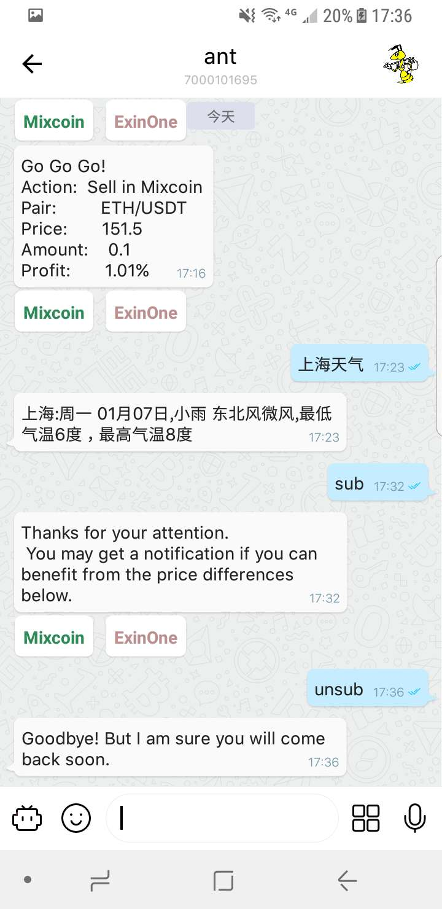

## 搬砖小蚂蚁

### Mixin ID: 7000101695

   一个在Ocean ONE和ExinOne上寻找搬砖机会的机器人，若存在约1%的价格差，则开启自动交易。若有用户订阅，
则向其推送套利信息，并给出交易的直达链接。大部分时间行情相当无聊，于是在小蚂蚁里链接一个聊天机器人。

### 运行

   进入demo目录，go build -o ant 编译，然后输入 ./ant run --ocean --exin 运行即可,需提供mysql和redis环境支持。
向机器人发送sub订阅，unsub取消订阅，其他看机器人心情回复。若行情过于无聊，无任何消息推送，欢迎去Ocean ONE上挂单。

### 注意
   代码中删除了去Ocean ONE和ExinOne上交易以及AI的代码，请参考各自的文档自行实现。

### 示意

   1. 向机器人订阅搬砖行情 sub
   2. 退订 unsub
   3. 聊天 上海天气如何？
   4. 接收行情信息， 去Ocean ONE或ExinOne上交易
   
   
